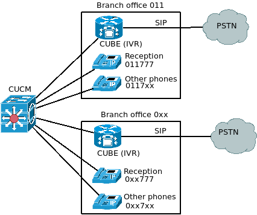

# cisco_isr_vxml_ivr

# Description
The script was created as simple IVR for branch offices, each of those have Cisco ISR router (CUBE) connected to PSTN through the SIP trunk.

This scheme means that the extension number of each IP phone contained branch office number (for example 011) and local number of employee (for example 777) = full number is 011777

As on the diagram



# Limitations
VXML IVR works fine for SIP trunks only (not for H.323)

# Format of audio files
.wav file, CCITT u-Law 8,000


# A part of Cisco IOS config
```
  application
    service disa flash0:IVR_011.vxml

  dial-peer voice 101 voip
    description ** IVR **
    service disa
    session protocol sipv2
    session target ipv4:<PSTN provider IP>
    incoming called-number <Incoming number of IVR>
    dtmf-relay rtp-nte
    voice-class codec 1
    no vad

  dial-peer voice 102 voip
    description ** To CUCM **
    destination-pattern 011...
    session protocol sipv2
    session target ipv4:<CUCM IP>
    voice-class codec 1
    dtmf-relay rtp-nte
    no vad
```
  
# Debugging

## Commands to trace DTMF for Cisco IOS
+ In the case of using the method rtp-nte: **debug voip rtp session named-event 101**
+ In the case of using the method SIP INFO: **debug ccsip messages**

## The log of VXML script: 
**debug voip application vxml puts**
```
  Example
    broff-011-router#
    Apr 19 14:37:07: !!!!++++ Destination phone Number wasn't recognize  ++++!!!!
    broff-011-router#
    Apr 19 14:37:26: !!!!++++ Destination phone Number wasn't inputted  ++++!!!!
    broff-011-router#
    Apr 19 14:38:31: !!!!++++ The Destination phone Number was recognized ++++!!!! 778
```

## For a detailed log of the IVR, you can use the commands:
+ debug voip application vxml event
+ debug voip application vxml application
+ debug voip application vxml error
+ debug voip application callsetup
+ debug voip application error
+ debug voip application vxml puts
+ debug mrcp error
+ debug ccsip messages
